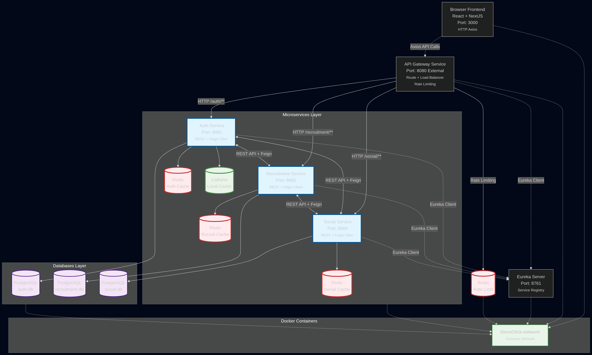
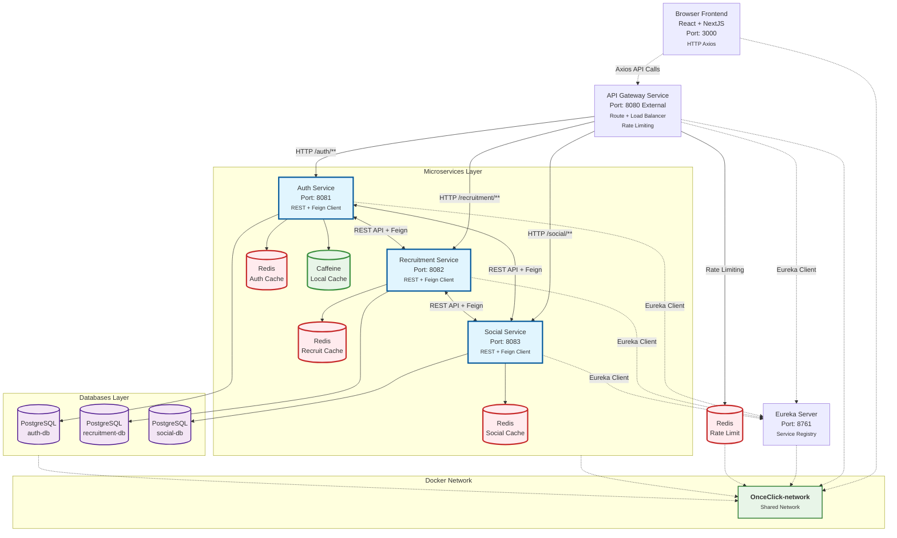

# 📋 OnceClick System Overview - Microservices Architecture



## 🔗 Mermaid Live Editor
> **[Edit Diagram](https://mermaid.live/edit#pako:eNqdV09v4kYU_yojr1ZKtiYhEMCxEBIYJ0tD_tSwXbWhWg32GKzYHjQ2DTSbQ3vooaf20mPVSy9VP8Fy6CH9InyTjmfGZjCOiuoTnvm9N-_93m_ew4-KjR2k6Irr4wd7CkkMht1RCOjz-jUwfA-FMejDJSJ88b3ZuRspHYIfIkTAOcFhjEKnOSbHLQtBOwafgWu0iD8fsKVbTGIdVMvlMnttRgH0_dbb4fAWtBcejprHfGWkfMPdZye3b3vgAsboAS758ele--I9DUDeHiDyrWcj6UCtrJWBuYgRCaEvn2zheYxoiH0MHdCBPgxtRHjw1Bnoe4EXe-FkJyzL7PYGH-jJBxZyvChncZgP3kITL4rJki-Y7yzzsk2DNucE3UMWrzhVhNuon8hRioQyNy-zJJCRXKFoPp4QOJuCgWl92TPMAaBHX3k2wdE2OvXGWH03fJvQOo-nxXxuBWiZgyFl8Rx5k1BoZCdGTpthUa8Wssnci4NESoXOK_s7T5NPnsGN0Wv36QEDbHvQL_Zd_T-Bb35RkofT5z8DwApPbQ3ousgLkZxlIg7GoCQPRqUB7Sk6lBwb7fNzs3dt3h2kfhi4j20a_w6ae2YsysLjdL4EF6xIBoKeHfxWlpfrT3_HIFyvfvGAnSC3xQFKpZaUacFmmtp2-SW75DVfPGmbL3AAbSk5pXdhDMcwQlFO5N0O03e2_YK2P3Q7dwe3OIonBA2-6DNaIK1QyRkf5gRbBCUbBecseNRFNhFjXYIXJIXte9rZrlH8gMl9PrMb49K0WHIcZtBeC6liSLSV3s21YRr9nnFJkc1x64a2NKps-74UcrfN43FLvgMGDgIcpofuyH83yrSRAhuHIbJjD4dRNgxA6ajU-kg7R9LOWdc2qDsa4cekU2ctO6kzRbHOf5wQf_zmDcNkWsqDJMoFlskJFKM52QIoK2kD3Orw3B9v6vl0eZfuepGNaZ9eSn54qgLA20fiiDd4gWPXYQ8gvxx7ANOLsgc0y6FHpzIpiX5P6xYE89CzYVI6KcymICZpiknlRGNMud4PKZPNctoTu7kEnV1hZU1F3F2ZMtYw2DXd5oeuZ5ex-J6JC_Gyjjd3abvo-XXOeeFWNnSLNpNmVbSeKrFwczPs46VPpQtKYLBe_dUG_fXq1x5Yr34D__z8_MNXHGf7MIq6yAVp8V3P9_VX6MStuUil_ybwPdJflU9qjbOxeC09eE481auzRc6FMxbWbhXV3FpmfQpPTjV727oyW6ShZvaEjUzhwkVjtAnArle0ivZfAaQFEzlobg1pmYsKajjVyk4UORe2GLPFPqqahqr2C2FkxD9_PwPOevUH5Z75pRWwes8_XV-ATm-9-nEIrlgl-jfrT7_3pPOZetVErKoQqShKHkMVqwpNq5mGKf0yLtWIuhnC6mauqvIM5cTLxulszuiQNzO9pXwrqjIhnqPoMZkjVQkQCWDyqjwmZiMlnqIAjRSd_nQgnVvKKHyiNjMYfo1xkJoRPJ9MFd2FfkTf5jOH9t-uB-lw20DosEHEwPMwVvTaaZn5UPRHZaHo5aNy8jSqtWq9oZ1VtXqj3NAqqrJU9NLZUeOkXKtXapXKWV1r1DRUajypynfs-HDu-6pCKYgxueIfN-wb5-lfOTHohg)**

## 📊 Mermaid Source Code


---

## 🏗️ **System Architecture Components**

| **Layer** | **Component** | **Port** | **Tech Stack** | **Primary Function** |
|-----------|---------------|----------|----------------|---------------------|
| **Client** | React + NextJS | 3000 | Axios | Frontend UI + API Calls |
| **Gateway** | API Gateway | **8080** | Spring Cloud Gateway | Routing, Load Balancing, Rate Limiting |
| **Registry** | Eureka Server | 8761 | Spring Eureka | Service Discovery & Registration |
| **Services** | Auth Service | 8081 | Spring Boot + Feign | Authentication & Authorization |
| | Recruitment Service | 8082 | Spring Boot + Feign | Job Management & Recruitment |
| | Social Service | 8083 | Spring Boot + Feign | Social Features & Interactions |
| **Cache** | Redis (per service) | - | Redis | Session Storage, Hot Data Caching |
| | Caffeine (Auth only) | In-memory | Caffeine | Local High-Speed Cache |
| **Database** | PostgreSQL (per service) | - | PostgreSQL | Persistent Data Storage |
| **Network** | OnceClick-network | Docker Bridge | Docker | Inter-service Communication |

## 🚀 **Deployment Instructions**

```bash
# Each service has individual docker-compose.yml
docker-compose up -d

# All containers join shared network
docker network create OnceClick-network

# External access ONLY through Gateway port 8080
curl http://localhost:8080/auth/login
curl http://localhost:8080/recruitment/jobs  
curl http://localhost:8080/social/feed
```

## 🔄 **Communication Flow**

1. **Client** → **API Gateway** (port 3000 → 8080)
2. **Gateway** → **Services** (route `/auth/**`, `/recruitment/**`, `/social/**`)
3. **Services** ↔ **Services** (REST API + Feign Client)
4. **Services** → **PostgreSQL** (dedicated DB per service)
5. **Gateway** → **Redis** (Rate Limiting)
6. **All Services** → **Eureka** (Service Discovery)

**Ready for GitHub Wiki, Confluence, or Notion!** ✅